# STT Workflow: private meeting transcription for the Mac

A fully local pipeline that turns voice memos into named, searchable, editable
meeting transcripts. Drop a recording into a watched folder (iCloud Drive,
synced from the iPhone Voice Memos app); minutes later you have a
speaker-labeled transcript with real names attached and a draft summary.
**No audio, text, or voice data leaves your machine** unless you explicitly
add a cloud transcription key; the only other network use is a one-time
model download.

Built for meetings you can't send to a cloud service: 1-on-1s, interviews,
personnel conversations, anything sensitive.

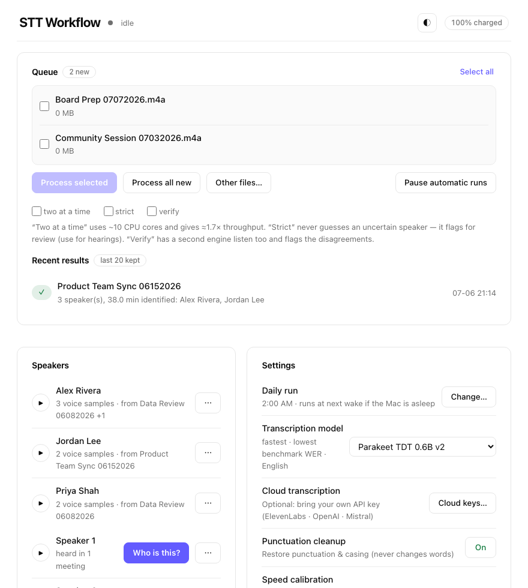

## Getting started

```bash
git clone https://github.com/<you>/stt-workflow && cd stt-workflow
./init.sh
```

`init.sh` walks the whole first run interactively: it checks the machine
(Apple Silicon required, memory, free disk), installs `ffmpeg` and `uv` if
missing, builds the Python environment, asks where recordings arrive and
where transcripts should land, takes your Hugging Face token, optionally
pre-downloads the models (~3 GB) and the local summarizer LLM (~4.5 GB), and
offers to install the automation (nightly run + menu-bar app). Every step
detects what is already done, so re-running it is always safe.

Manual setup, and what each step does, is in [Setup details](#setup-details)
below.

## The workflow

Everything below happens in the control panel (`http://127.0.0.1:8737`,
local-only) or its menu-bar companion. The engine room: two GPU-accelerated
transcription engines on Apple's MLX framework (NVIDIA Parakeet TDT 0.6B v2,
~30× realtime and the English word-error-rate leader among local models, and
Whisper large-v3/turbo for punctuation and noise robustness), pyannote
diarization, and your own voiceprint library attaching real names. Anything
ffmpeg reads is accepted, video included.

### 1 · Capture and process

Recordings land in the watched folder (iCloud Drive by default) and process
nightly, within a minute of arriving while the Mac is awake, and at login
catch-up. The queue card lets you process everything new, a hand-picked
selection, or files from anywhere on disk ("Other files…"), with four
per-run options:

- **two at a time**: parallel workers, ≈1.7× throughput for a backlog
- **strict**, for confidential conversations: never guess an uncertain
  speaker (flag it for review instead), and never send audio to any cloud
  engine whatever the global settings say
- **verify**: a second, architecturally different engine transcribes too;
  every disagreement is flagged with both candidates (where the engines
  agree, ~95% of words on our benchmark, they matched an independent
  commercial reference ~94% of the time)
- **one-time speakers**, for focus groups: unnamed voices are never added to
  the speaker library and no voice samples are kept for them

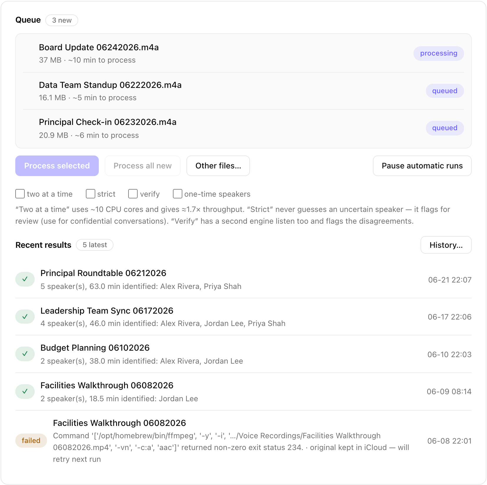

While a run is live the panel shows exactly where the file is and how long
each step is taking: finished stages with their actual times, the current
stage as elapsed against expected, and the stages still ahead with their own
estimates, so transcription and speaker separation are never blended into
one blurry number (visible in the panel shot above). Estimates count down in
real time, calibrated from your machine's measured throughput on past runs,
and a Stop button kills the whole process group and verifies nothing is
left. Runs are idempotent by manifest: the iCloud original is
deleted only after outputs are verified, and a run interrupted mid-file
simply re-runs that file next time.

Reprocessing an existing meeting (Redo) offers the same options:

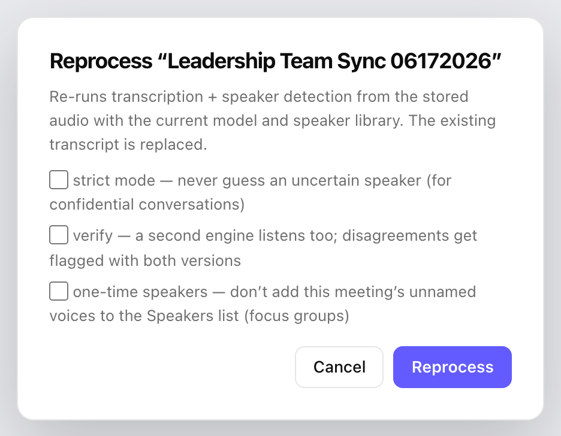

### 2 · Read and fix

The viewer color-codes speakers, plays audio from any line, follows playback
with a live highlight, and shows when the transcript was last processed:

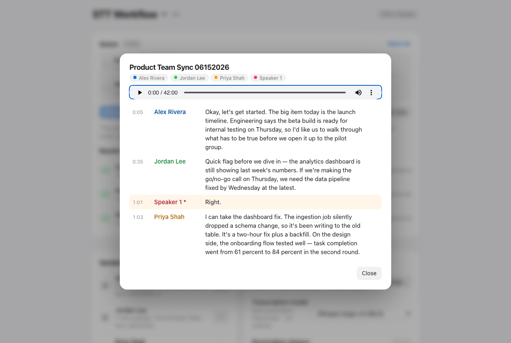

A find bar (or ⌘F) searches within the open transcript: it counts every
occurrence, Enter and the ‹ › buttons jump between highlighted matches with
the current one accented, and Escape clears the search without closing the
viewer:

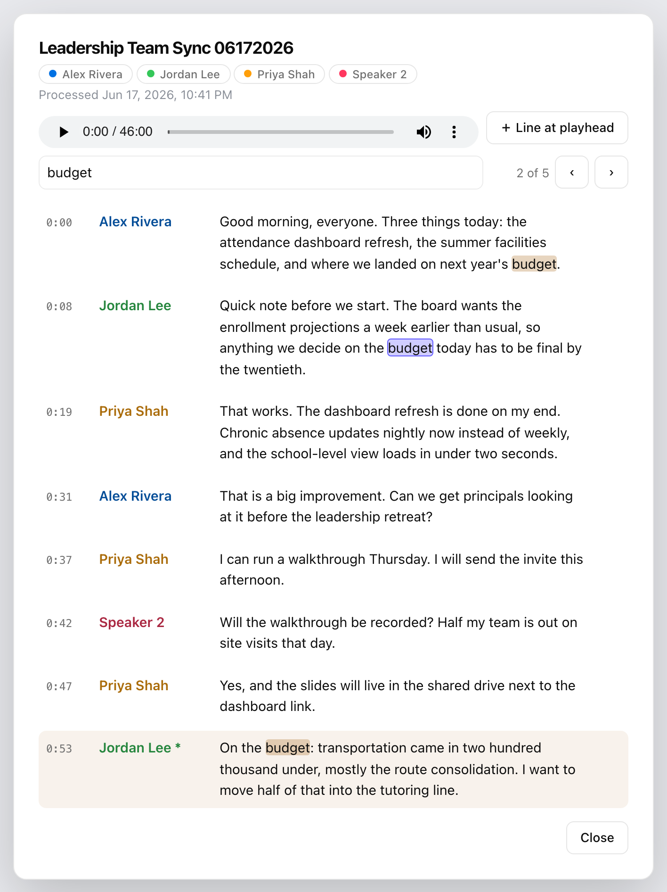

Every line is editable: fix text, reassign the speaker (to anyone, including
a person the diarizer never detected), add a line the pipeline missed,
remove a bogus one, or **split** a line where two people got glued together.
A reassigned line auto-merges with its now-matching neighbors, so one edit
heals the whole turn, and a "re-transcribe this span" button gets a second
opinion from a different engine on any single line. Human edits live in a
sidecar file and survive every reprocessing of speaker labels:

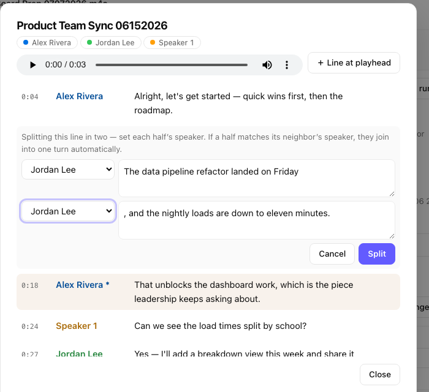

Uncertain segments are flagged and triaged: substantial items first,
sub-second crosstalk crumbs bulk-acceptable in one click. Each review item
cues its exact audio span, shows the second engine's candidate when verify
mode ran, and the ‹ › arrows (or ←/→) flip through items without acting on
them:

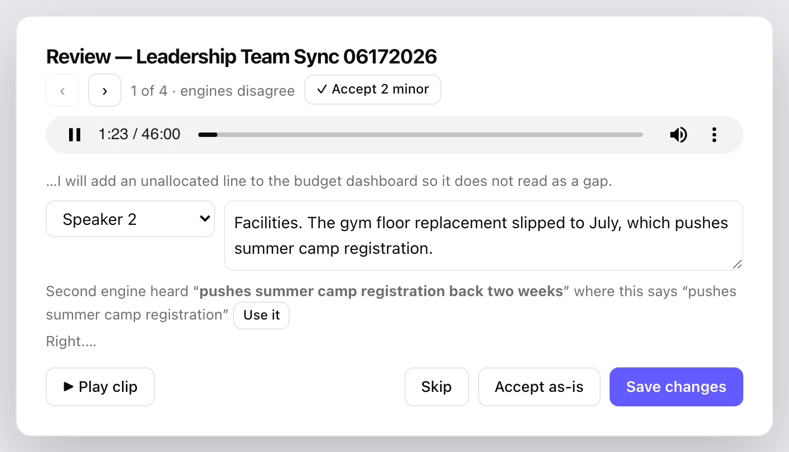

### 3 · Name the speakers

Name a speaker once ("Who is this?" plays their voice first) and every past
and future transcript updates in seconds, because per-turn voice embeddings
are cached, so re-labeling never reprocesses audio. Unknown voices keep
stable numbers across meetings ("Speaker 2" is the same person everywhere),
and matching is open-set with a score-plus-margin gate: a stranger near an
enrolled voice never inherits that person's name, and interviews stay
honest. One-time voices you chose to hide restore with one click from the
"n hidden" toggle. The roster lists alphabetically by first name with
unnamed voices at the bottom and scrolls as it grows; a search box finds
any speaker by name (or, for unknown voices, by the meeting they were heard
in), and an "unidentified only" filter shows just the voices still waiting
for a name:

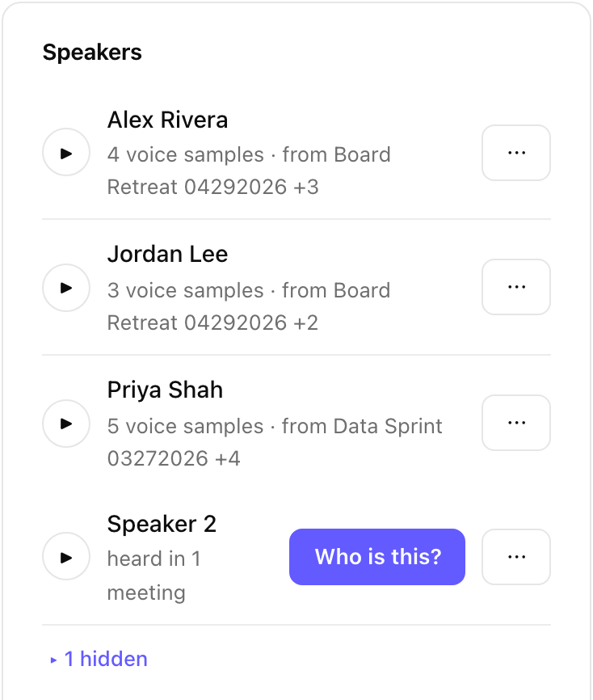

"Who is this?" makes the identification itself easy: one clip from each
meeting the voice was heard in, labeled with its source, playing up to 45
seconds of that person's longest turn, and when a clip alone is not enough,
Read opens the transcript at that exact moment so you can hear the
conversation around it. The name box suggests the closest enrolled names as
you type, because typing an existing name merges this voice into that
person:

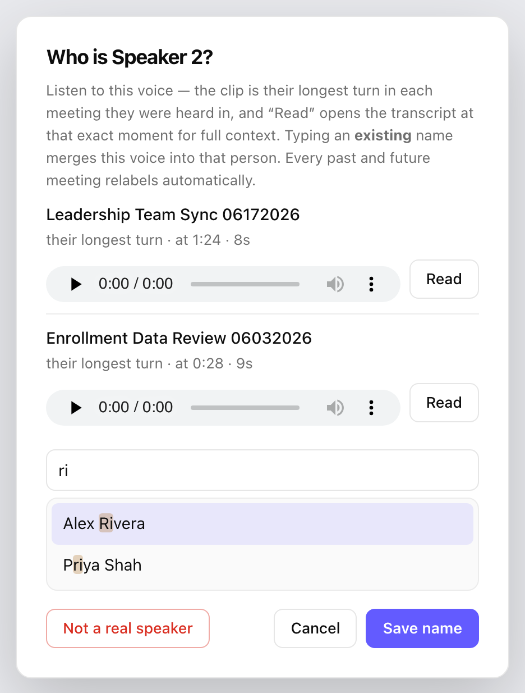

The ⋯ menu on any speaker manages the profile. Play any voice sample (each
traceable to its source meeting), and when one is wrong, either remove it (a
bad recording, where the person is still right) or **reassign** it (→) to
the correct person, which moves the voiceprint to them instead of discarding
it. You can also rename everywhere, merge duplicates, or un-enroll. A
profile keeps up to five samples; a varied set, from different meetings,
rooms, and mics, identifies someone more reliably than several clips from
one recording. Any sample edit re-runs identification across every meeting,
so a correction propagates the same way naming does:

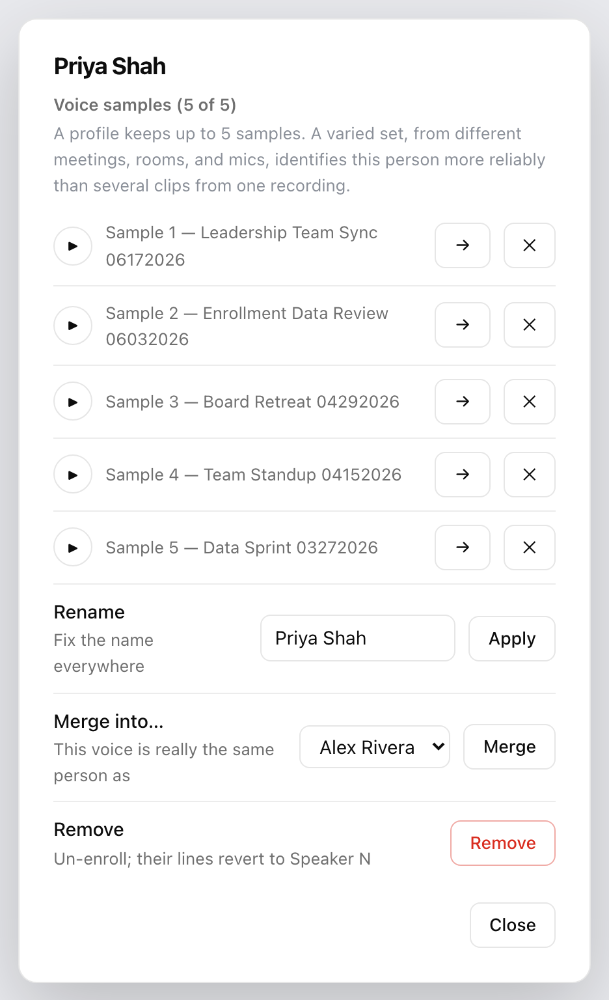

If the registry is ever lost, `tools/rebuild_voiceprints.py` reconstructs
every voiceprint from the meeting caches; the batch also warns loudly if it
starts with an empty registry while named transcripts exist, and every
registry write keeps a rolling backup.

### 4 · Summaries, next steps, and Ask

The moment a recording finishes processing, Qwen3-8B (4-bit, on-device)
drafts its brief summary and extracts **Committed next steps**: every stated
commitment as "[Speaker] will *action* by *date*". Both show in the Summary
dialog and in the hover tooltip on any meeting row:

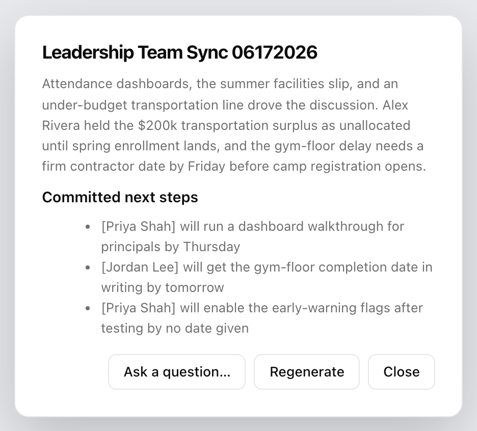

The same assistant powers **Ask**: pick a meeting, ask questions about
it, and get answers drawn from that transcript only, citing timestamps.
Follow-up questions understand the earlier ones, and the thread is never
stored. On the local model each answer takes roughly 20-60 seconds (the
model loads fresh per question) and nothing leaves the machine:

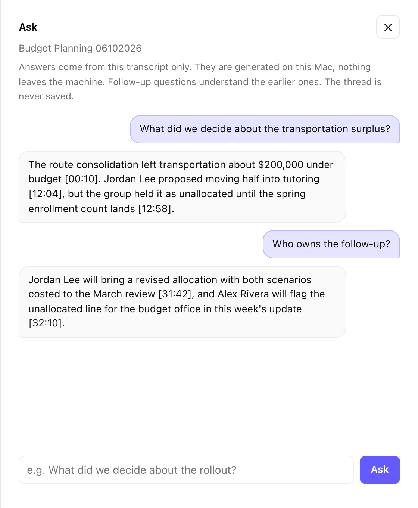

Summaries and Ask can also run on a **cloud assistant** instead of the
local model: bring an Anthropic key (Claude Haiku) or reuse your OpenAI
key, then pick the assistant in Settings. Cloud answers arrive in seconds
and suit machines without the 4.5 GB local model, with the honest trade
spelled out in the picker: transcript text is uploaded to that provider
for these features, and strict-mode recordings always use the local model
regardless of the setting, exactly like strict transcription never
uploads audio.

### 5 · The library: search and organize

The library lists meetings by month or, with the sort toggle, alphabetically
by title, showing each meeting's date, length, attendees, review chips, and
summary snippet inline; Read, Summary, and Ask are one click from any row:

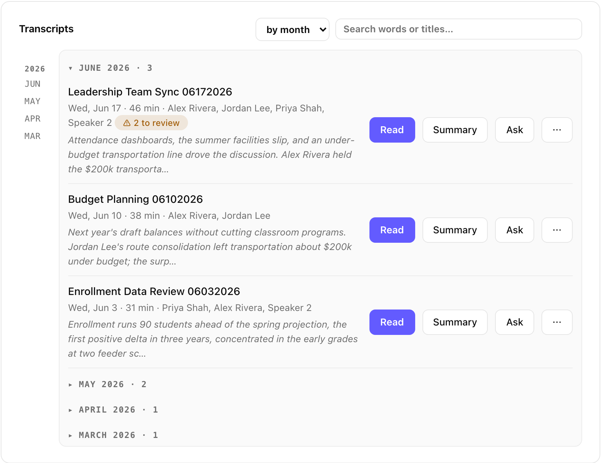

Full-text search jumps straight to the moment anything was said, audio cued;
the same box filters the library by title or attendee:

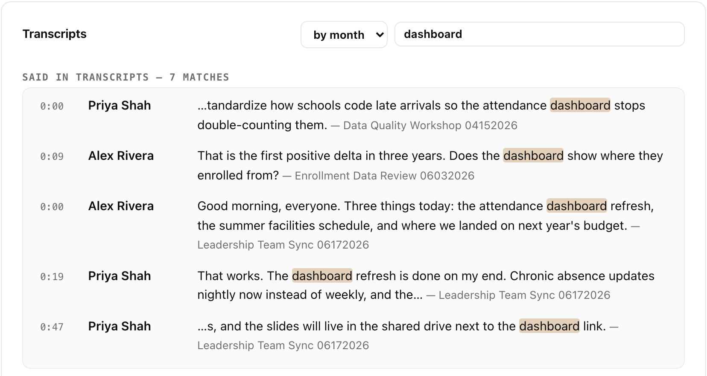

Meeting titles and dates are editable in place (click either in the list) or
via the Rename dialog, which also offers an LLM-suggested title from the
transcript's content. Dates are stamped at processing time from the filename
convention and survive reprocessing; file timestamps are never trusted,
because they reflect when Voice Memos exported the file:

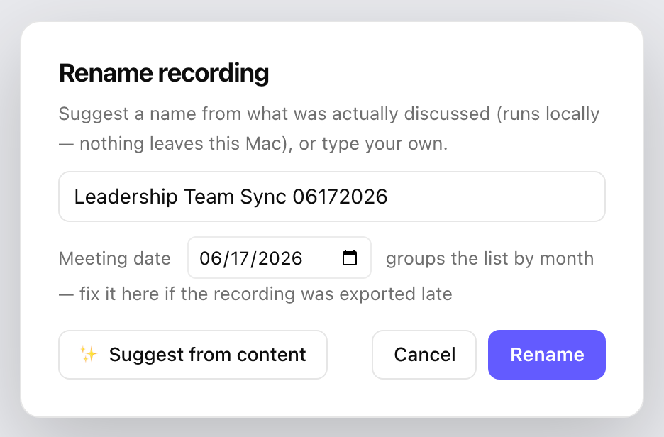

### 6 · Export

Each meeting exports to Word (.docx) or print-ready PDF, copies to the
clipboard as plain text, or reveals in Finder:

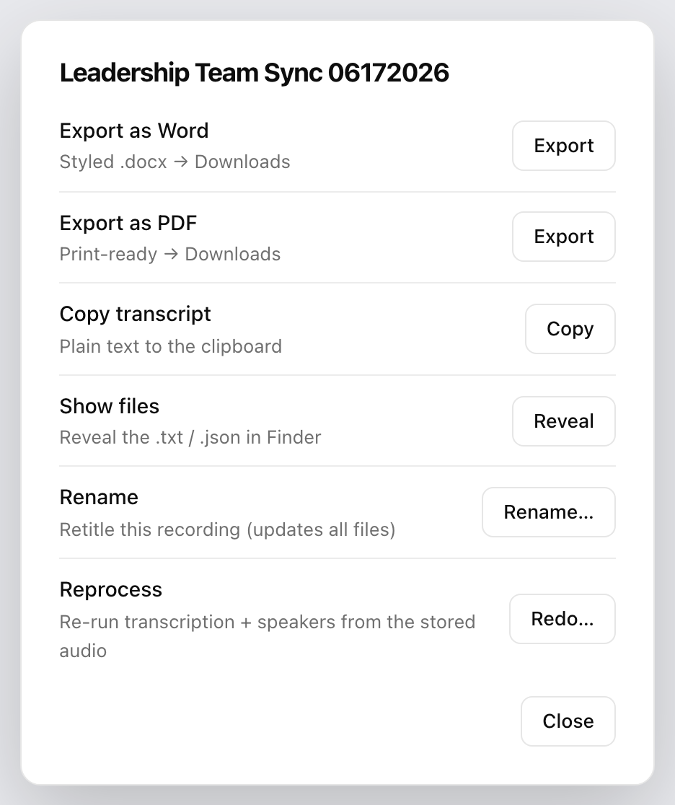

On disk, every meeting is a self-contained folder (audio, readable `.txt`,
structured `.json` with segment- and word-level timestamps, speakers, flags,
and real confidence scores, caches, and edit history together), and renaming
in the panel renames the folder and every file in it. Writes are atomic
everywhere; a reader can never see a half-written transcript.

### 7 · Configure

Settings live in a slide-over panel behind the gear in the top bar, so
they are reachable from any scroll position without crowding the page.
They cover the two automatic triggers, each with its own switch: the
folder watch (a new recording starts processing within moments of landing
while the Mac is awake) and the nightly run (everything new at a set
time). Turn both off for fully manual operation. It also covers the
transcription model (local engines, plus cloud ones once a key is added),
the summaries-and-Ask assistant (local Qwen by default, Claude or OpenAI
by key), punctuation cleanup, speed calibration, a model-update check, and
the watched and transcripts folders:

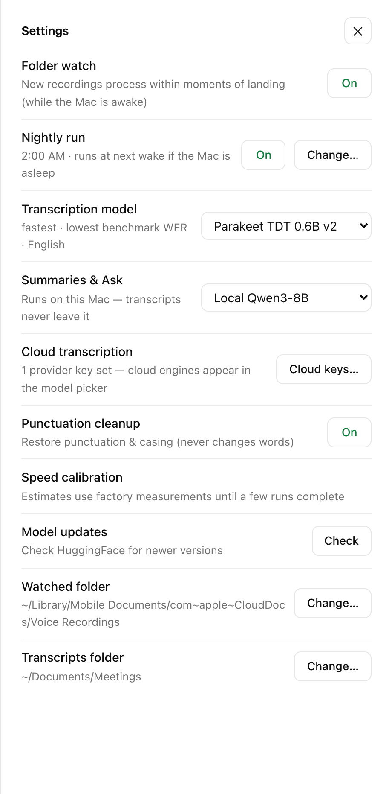

Cloud transcription is bring-your-own-key for ElevenLabs Scribe, OpenAI, and
Mistral Voxtral: only the audio uploads (recompressed small), diarization
and voiceprints stay on-device so cloud words still get local names, a cloud
failure falls back to the local engine mid-run, and strict-mode recordings
never upload. Keys live in `stt.env` (git-ignored, `chmod 600`) and are
never shown again; a saved key can be replaced by pasting a new one or
removed with its Clear button:

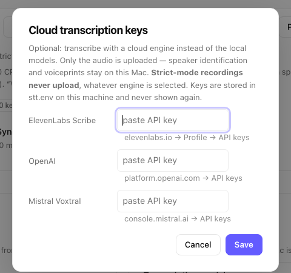

## Light and dark

The panel follows macOS light/dark by default; the toggle in the top bar
pins either, and the choice persists:

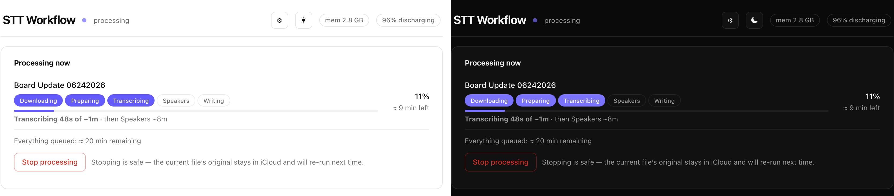

## Requirements

- **Apple Silicon Mac (M-series), required.** The transcription engines and
  the summarizer run on MLX, which only exists for Apple Silicon. This will
  not run on Windows, Linux, or Intel Macs. 16 GB RAM works; 24 GB+ is
  recommended for two-at-a-time processing and the local LLM.
- macOS 14+ (developed on macOS 26)
- [Homebrew](https://brew.sh) (`init.sh` installs `ffmpeg` and
  [`uv`](https://docs.astral.sh/uv/) through it)
- A free [Hugging Face](https://huggingface.co) account (the diarization
  model is license-gated; inference is local, no payment)

## Setup details

`./init.sh` does all of this for you; the pieces, for reference:

```bash
brew install ffmpeg uv
uv venv --python 3.12 .venv          # 3.13+/3.14 lack wheels for some ML deps
uv pip install --python .venv/bin/python -r requirements.txt
```

**Hugging Face token (one-time, required for speaker identification):**
1. Signed in on huggingface.co, open
   [pyannote/speaker-diarization-community-1](https://huggingface.co/pyannote/speaker-diarization-community-1)
   and click *"Agree and access repository"* (accept any dependency repos it
   lists too).
2. Create a **read** token at [hf.co/settings/tokens](https://hf.co/settings/tokens).
3. Put `HF_TOKEN=hf_…` in `stt.env`; the file is git-ignored and never
   leaves your machine.

**Optional local LLM** for summaries, Ask, and smart renames (Qwen3-8B-4bit,
~4.5 GB; its own environment because its `transformers` pin conflicts with
the audio stack):

```bash
uv venv --python 3.12 .venv-llm
uv pip install --python .venv-llm/bin/python mlx-lm 'transformers<5'
```

Summaries, Ask, and "Suggest from content" light up automatically once
`.venv-llm` exists; everything else works without it.

**Folders.** The watched folder defaults to iCloud Drive's `Voice Recordings`;
transcripts land where you point them (one folder per meeting, holding the
audio, transcript, caches, and edit history together). Change either in the
control panel's Settings or via `STT_ICLOUD_DIR` / `STT_MEETINGS_DIR` in
`stt.env`.

**Automation:**

```bash
./setup.sh gui-install       # menu-bar app + control panel
./setup.sh install-agent     # nightly run + folder watch + login catch-up
```

launchd plists are generated with your paths; nothing machine-specific is
stored in the repo. The installer prints the Python binary that needs
**Full Disk Access** (System Settings → Privacy & Security) so the
background job can read iCloud Drive. Overnight runs need AC power; for a
true night wake: `sudo pmset repeat wakeorpoweron MTWRFSU 01:57:00`.

## Everyday use

Everything routes through the control panel: process recordings, watch live
progress, name speakers (▶ plays a voice sample, "Who is this?" names it),
review flagged segments against audio, read/search/edit transcripts, ask
questions, export.

CLI equivalents:

```bash
./run.sh batch --dry-run                          # show what would process
./run.sh batch --strict --files "Interview.m4a"   # strict: flag, never guess
./run.sh relabel --all                            # re-apply names everywhere
./run.sh enroll --from-meeting "Team Sync 05212026"
./run.sh test                                     # 280+ tests
```

## How it works

```
watched folder (iCloud)                          transcripts folder
  new .m4a/.mp4 ─► materialize ─► ffmpeg ─► ASR (MLX GPU or cloud) ─► loop-collapse
                                               │
             pyannote diarization (CPU) ───────┤
             voiceprint matching               ▼
             identity refinement ─► word↔speaker merge ─► punctuate
                                               │
              .txt + .json + cached embeddings (instant re-labeling)
                                               │
        review/edit decisions (sidecar, survive relabels) ─► search / export / summaries / Ask
```

Model attribution (CC-BY-4.0 weights): see [NOTICE.md](NOTICE.md).

## Limitations

The pipeline runs entirely on your Mac with open models, so it trades some
accuracy for privacy and control. What that means in practice:

- **Overlapping speech is the weak spot.** When two people talk at once, no
  open diarizer attributes the overlapping words cleanly, so crosstalk is where
  you will see the most speaker errors. The panel flags overlap regions for
  review rather than hiding them.
- **Audio quality drives everything else.** A phone on a conference table picks
  up room echo, fan and HVAC hum, and volume falloff with distance; a far
  speaker, a hard-surfaced room, or a noisy line each raise the word error rate
  and blur speaker boundaries. A recording made close to each talker in a quiet
  room is worth more than any model choice.
- **More speakers, more mistakes.** Two or three people separate cleanly. A
  large group, or a room where people trade off in quick bursts, gives the
  diarizer more chances to split one voice into two or merge two into one.
  Voiceprints name the regulars well; strangers in a crowd stay approximate.
- **Names depend on enrollment.** Someone is labeled only once you have a
  voiceprint for them, and a match can still miss across a very different room
  or mic. A varied sample set (see speaker profiles above) is the fix.
- **Accuracy trails the cloud services by a few points on clean audio, and by
  more on hard audio.** For a confidential recording that cannot leave the
  machine, that is the trade. For anything that can, the bring-your-own-key
  cloud engines are there and still get local names.

### Why the text reads rougher than a cloud service

That roughness is a missing normalization step, not extra errors. The local
engine writes words as spoken: lowercase, numbers spelled out, few capitals,
light punctuation. Commercial services such as Scribe run a fast second model,
inverse text normalization, that rewrites "twenty twenty six" as "2026",
restores casing and punctuation, and fixes obvious misspellings. The words are
the same; only the presentation differs. For now you can normalize a transcript
yourself after export when it needs to be reader-ready, and we are looking at
running that cleanup at export time, so the stored transcript stays a faithful
record while an exported copy reads clean.

## If you record other people

This tool stores voiceprints (**biometric data**) and verbatim records of
what people said. Treat both with care:

- The `.gitignore` keeps voiceprints, transcripts, audio, tokens, and all
  runtime state out of git. Review it before changing output paths.
- Know your local laws on recording consent (one-party vs all-party) and any
  workplace policies before making recording a routine practice.
- Set `HF_HUB_OFFLINE=1` in `stt.env` after models are cached to enforce
  fully-offline operation. The control panel binds to `127.0.0.1` only.
- Cloud transcription is off unless you add a key, and strict-mode
  recordings never upload even then.
- The summaries/Ask assistant is local by default; selecting a cloud
  assistant uploads transcript text for those features, and strict-mode
  recordings always stay on the local model regardless.

## License

[MIT](LICENSE)
