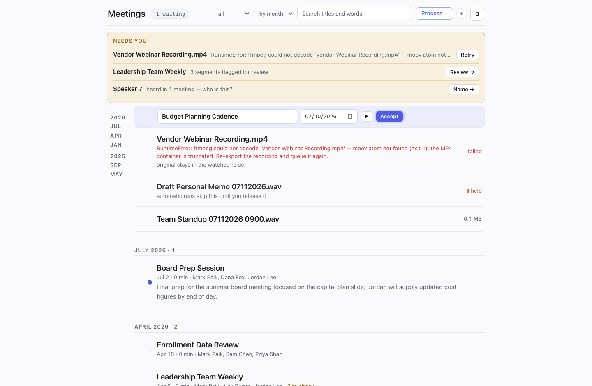
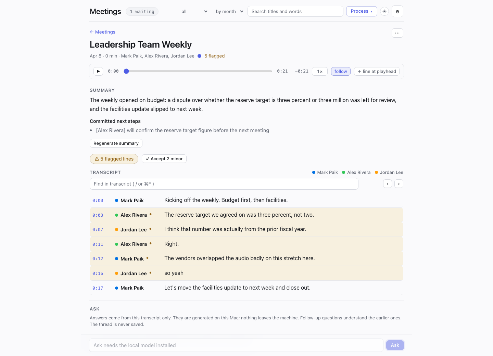

# STT Workflow: private meeting transcription for the Mac

**Version 1.0**

A fully local pipeline that turns voice memos into named, searchable, editable
meeting transcripts. Record from the menu bar or drop a file into a watched
folder; minutes later you have a speaker-labeled transcript with real names
attached, a draft summary, and committed next steps. **No audio, text, or
voice data leaves your machine** unless you explicitly add a cloud key; the
only other network use is a one-time model download.

Built for meetings you can't send to a cloud service: 1-on-1s, interviews,
personnel conversations, anything sensitive.



## Getting started

```bash
git clone https://github.com/<you>/stt-workflow && cd stt-workflow
./init.sh
```

`init.sh` walks the whole first run interactively: it checks the machine
(Apple Silicon required, memory, free disk), installs `ffmpeg` and `uv` if
missing, builds the Python environment, asks where recordings arrive and
where transcripts should land, takes your Hugging Face token, optionally
pre-downloads the models (~3 GB) and the local summarizer LLM (~4.5 GB), and
offers to install the automation (nightly run + menu-bar app). Every step
detects what is already done, so re-running it is always safe.

Manual setup, and what each step does, is in [Setup details](#setup-details)
below.

## The idea

The panel (`http://127.0.0.1:8737`, local-only) is built on one principle:
**a meeting is one object.** It enters the timeline the moment audio exists,
as a single row that changes state in place: recording, waiting, transcribing
with live progress, waiting for its name, ready. Nothing teleports between
cards; there is no separate queue screen to reconcile with a results screen.
The library is the whole interface, one amber tray collects everything that
needs you, and all machinery lives behind one Process button and one settings
drawer.

The engine room underneath: two GPU-accelerated transcription engines on
Apple's MLX framework (NVIDIA Parakeet TDT 0.6B v2, ~30x realtime and the
English word-error-rate leader among local models, and Whisper
large-v3/turbo for punctuation and noise robustness), pyannote diarization,
and your own voiceprint library attaching real names. Anything ffmpeg reads
is accepted, video included.

## The timeline

Every meeting is one row, and the row tells you everything: a category dot,
the title, date, length and attendees, a two-line summary preview, and its
current state at the right edge.

- **Actionable rows pin to the top**, whatever their date: a live recording
  with its ticking clock, files transcribing with a progress hairline and
  live estimates, new transcripts waiting for a name, failures with their
  full error, held files, and waiting files. A failed April file sits at the
  top, not buried in April.
- **Ready meetings group by month**, newest first, with Today and Yesterday
  called out, collapsible chapters, and a jump rail to any month or year, so
  a hundred meetings stay one glance deep. Sort alphabetically instead with
  one click.
- **New transcripts wait for their name.** Nothing slips silently into a long
  list: a naming row holds each new transcript with a suggested title (drafted
  by the local LLM from the content) and the date parsed from the filename.
  Fix either, press Enter, and it files itself.
- **Click a row to peek**: it expands in place with the full summary and
  committed next steps. Click the title or the date to edit them right there.
  Hover for actions: play the audio inline with a scrubber, open the
  transcript, or the full menu (export, copy, reveal, rename, reprocess,
  archive, delete).
- **Select many, act once**: checkboxes appear on hover, shift-click selects
  a range, and a floating bar applies tags, renames, dates, archive, or
  delete to the whole selection.
- **Drag audio from anywhere** onto the page and it queues; a synthetic row
  shows the upload and becomes the real one when the file lands. Or use
  Process > Other files for a picker.
- **Search everything**: the box filters by title and attendee as you type,
  and full-text results show every place a phrase was said; clicking one
  opens the meeting with the audio cued to that exact moment.
- **Keyboard throughout**: `/` focuses search, `j`/`k` walk the rows, `Enter`
  opens (or accepts a naming row), `e` peeks the summary, `Escape` backs out.

The status pill next to the wordmark is the only place pipeline state
appears: a ticking record light, "transcribing 2 · about 14 min", "paused ·
3 waiting", or nothing at all when everything is done. Clicking it opens the
Process popover: run everything new, run a selection, stop a run, pause or
resume the automation, cancel a queued run, and the four per-run options.

## The tray

One amber band under the header collects everything that needs a decision,
and disappears entirely when nothing does. Rare, urgent items get their own
line: a recording that is capturing nothing (with a fix button), a file that
failed (with retry and the full error). Chronic items aggregate so the tray
never shouts: "Flagged lines in 12 meetings" filters the library to just
those meetings with one click, and "2 voices need names" opens the naming
panel per voice. A recording that saves cleanly shows a quiet note that
expires by itself.

## Capture and process

Record calls directly from the menu-bar app (mic and system audio on
separate channels, pause and resume, a live clock, and loud warnings if
macOS stops delivering audio), or let recordings land in the watched folder
(iCloud Drive by default, synced from the iPhone Voice Memos app). Files
process within a minute of arriving while the Mac is awake, at a nightly
run, and at login catch-up; pausing automation gates every trigger with one
switch. A held file waits indefinitely without blocking anything else.

Four per-run options, from the Process popover:

- **two at a time**: parallel workers, about 1.7x throughput for a backlog
- **strict**, for confidential conversations: never guess an uncertain
  speaker (flag it for review instead), and never send audio to any cloud
  engine whatever the global settings say
- **verify**: a second, architecturally different engine transcribes too;
  every disagreement is flagged with both candidates (where the engines
  agree, ~95% of words on our benchmark, they matched an independent
  commercial reference ~94% of the time)
- **one-time speakers**, for focus groups: unnamed voices are never added to
  the speaker library and no voice samples are kept for them

While a run is live, the row shows the current stage, percent, and a time
estimate calibrated from your machine's measured throughput on past runs.
Stop kills the whole process group and verifies nothing is left. Runs are
idempotent by manifest: the original is deleted only after outputs are
verified, and a run interrupted mid-file simply re-runs that file next time.
The drawer's History section keeps the complete, permanent record of
everything ever processed, grouped by day, searchable, filterable to
failures, with full error text preserved.

## The meeting page

Open a meeting and everything about it is one document:



- **Docked audio** stays put while you scroll: play, scrub, playback speed up
  to 2x, and a follow mode that highlights the line being spoken and keeps it
  in view until you scroll away (click any line to seek there and re-engage).
- **The transcript** color-codes speakers and is editable everywhere: fix
  text, reassign a speaker (including someone the diarizer never detected),
  split a line where two people got glued together, remove a bogus line, add
  a missed one at any gap or at the playhead, or re-transcribe a single span
  with a different engine for a second opinion. A reassigned line auto-merges
  with matching neighbors, so one edit heals the whole turn. Human edits live
  in a sidecar file and survive every reprocessing.
- **Find in transcript** (`/` or Cmd+F) counts occurrences and steps between
  highlighted matches.
- **Flagged lines review**: uncertain segments are washed amber, and a fixed
  verdict bar docks under the audio while you step through them in transcript
  order, top to bottom: arrows or `n`/`p` to move, play cues the exact span,
  one press accepts an accurate line and advances (Enter), one key takes the
  second engine's wording when verify mode ran (`u`), sub-second crosstalk
  crumbs accept in bulk, and "accept all remaining" sits behind a confirm.
  Editing never yanks you away: saves, splits, and inserts hold your place,
  and you move on only when you say so.
- **Summary and committed next steps** are drafted on-device the moment
  processing finishes: a brief summary plus every stated commitment as
  "[Speaker] will do the thing by the date". Regenerate on demand.
- **Ask** is pinned at the bottom: questions answered from this transcript
  only, citing timestamps, with follow-ups understanding the thread. Nothing
  is stored; the thread lives until you leave. Local answers take roughly
  20-60 seconds; a cloud assistant (bring an Anthropic or OpenAI key) answers
  in seconds, with the trade spelled out in the picker, and strict-mode
  meetings always stay on the local model.

## Name the speakers

Name a voice once and every past and future transcript updates in seconds,
because per-turn voice embeddings are cached and re-labeling never
reprocesses audio. Unknown voices keep stable numbers across meetings
("Speaker 2" is the same person everywhere), and matching is open-set with a
score-plus-margin gate: a stranger near an enrolled voice never inherits
that person's name.

The naming panel slides in from the tray or from any unknown name in a
transcript's legend: one clip from each meeting the voice was heard in
(their longest turn, with a link that opens the transcript at that exact
moment for context), a name box that suggests enrolled names as you type
(typing an existing name merges the voice into that person), and "Not a real
speaker" for noise. If a voice's source recordings were later deleted, the
panel says so plainly instead of presenting a dead player.

Speaker management lives in the drawer: play any voice sample (each
traceable to its source meeting), remove a bad one or reassign it to the
right person, rename everywhere, merge duplicates, hide voices you'll never
name (restorable anytime), or un-enroll someone. A profile keeps up to five
samples; a varied set across meetings, rooms, and mics identifies someone
more reliably than several clips from one recording. Every edit re-runs
identification across all meetings automatically, and rapid back-to-back
namings all land.

If the registry is ever lost, `tools/rebuild_voiceprints.py` reconstructs
every voiceprint from the meeting caches; the batch warns loudly if it
starts with an empty registry while named transcripts exist, and every
registry write keeps a rolling backup.

## The drawer

Everything mechanical lives behind the gear, in one panel with four
sections:

- **Settings**: one master switch for automatic runs, with folder watch and
  the nightly schedule beneath it (visibly inert while the master is off, so
  no toggle ever lies to you); the transcription model; the summaries-and-Ask
  assistant; cloud keys; punctuation cleanup; your own voice for recorded
  calls; a model-update check; speed calibration; and both folders.
- **Speakers**: the management surface described above.
- **History**: the permanent processing log.
- **Archive**: meetings set aside without deleting; restore any of them, or
  delete forever behind a two-step confirm. Archive from any row's menu or in
  bulk.

Cloud transcription is bring-your-own-key for ElevenLabs Scribe, OpenAI, and
Mistral Voxtral: only the audio uploads (recompressed small), diarization
and voiceprints stay on-device so cloud words still get local names, a cloud
failure falls back to the local engine mid-run, and strict-mode recordings
never upload. Keys live in `stt.env` (git-ignored, `chmod 600`) and are
never displayed again; the panel shows only that a key exists.

## Export

Each meeting exports to Word (.docx) or print-ready PDF, copies to the
clipboard as plain text, or reveals in Finder, from the row menu or the
meeting page. On disk, every meeting is a self-contained folder (audio,
readable `.txt`, structured `.json` with segment- and word-level timestamps,
speakers, flags, and real confidence scores, caches, and edit history
together), and renaming in the panel renames the folder and every file in
it. Writes are atomic everywhere; a reader can never see a half-written
transcript.

## Light and dark

The panel follows macOS light/dark by default; the toggle in the top bar
pins either, and the choice persists:


## Requirements

- **Apple Silicon Mac (M-series), required.** The transcription engines and
  the summarizer run on MLX, which only exists for Apple Silicon. This will
  not run on Windows, Linux, or Intel Macs. 16 GB RAM works; 24 GB+ is
  recommended for two-at-a-time processing and the local LLM.
- macOS 14+ (developed on macOS 26)
- [Homebrew](https://brew.sh) (`init.sh` installs `ffmpeg` and
  [`uv`](https://docs.astral.sh/uv/) through it)
- A free [Hugging Face](https://huggingface.co) account (the diarization
  model is license-gated; inference is local, no payment)

## Setup details

`./init.sh` does all of this for you; the pieces, for reference:

```bash
brew install ffmpeg uv
uv venv --python 3.12 .venv          # 3.13+/3.14 lack wheels for some ML deps
uv pip install --python .venv/bin/python -r requirements.txt
```

**Hugging Face token (one-time, required for speaker identification):**
1. Signed in on huggingface.co, open
   [pyannote/speaker-diarization-community-1](https://huggingface.co/pyannote/speaker-diarization-community-1)
   and click *"Agree and access repository"* (accept any dependency repos it
   lists too).
2. Create a **read** token at [hf.co/settings/tokens](https://hf.co/settings/tokens).
3. Put `HF_TOKEN=hf_…` in `stt.env`; the file is git-ignored and never
   leaves your machine.

**Optional local LLM** for summaries, Ask, and suggested titles
(Qwen3-8B-4bit, ~4.5 GB; its own environment because its `transformers` pin
conflicts with the audio stack):

```bash
uv venv --python 3.12 .venv-llm
uv pip install --python .venv-llm/bin/python mlx-lm 'transformers<5'
```

Summaries, Ask, and suggested titles light up automatically once `.venv-llm`
exists; everything else works without it.

**Folders.** The watched folder defaults to iCloud Drive's `Voice
Recordings`; transcripts land where you point them. Change either in the
drawer's Settings or via `STT_ICLOUD_DIR` / `STT_MEETINGS_DIR` in `stt.env`.

**Automation:**

```bash
./setup.sh gui-install       # menu-bar app + control panel
./setup.sh install-agent     # nightly run + folder watch + login catch-up
./setup.sh build-recorder    # the call recorder (mic + system audio)
```

launchd plists are generated with your paths; nothing machine-specific is
stored in the repo. The installer prints the Python binary that needs
**Full Disk Access** (System Settings > Privacy & Security) so the
background job can read iCloud Drive. The recorder needs Microphone and
"System Audio Recording Only" permissions; the panel walks you through both
and warns in the tray, during and after a capture, if macOS stops delivering
audio. Overnight runs need AC power; for a true night wake:
`sudo pmset repeat wakeorpoweron MTWRFSU 01:57:00`.

## Everyday use

Everything routes through the panel: record or drop audio, watch it move
through the timeline, name it, review the flagged lines, read, search, ask,
export. The menu bar mirrors the essentials: start, pause, and stop
recording, live progress, recent results, run now, pause automation, and
quick links to the panel and folders.

CLI equivalents:

```bash
./run.sh batch --dry-run                          # show what would process
./run.sh batch --strict --files "Interview.m4a"   # strict: flag, never guess
./run.sh relabel --all                            # re-apply names everywhere
./run.sh enroll --from-meeting "Team Sync 05212026"
./run.sh test                                     # 500+ tests
```

For development and testing there is a fully sandboxed data home:
`tools/demo_seed.py --dir qa/demo_home` builds a synthetic library
(generated audio, fictional names) covering every panel state, and
`STT_HOME` points a second server instance at it, scheduling included, so
nothing you try there can touch your real meetings.

## How it works

```
watched folder / recorder                        transcripts folder
  new .m4a/.mp4 ─► materialize ─► ffmpeg ─► ASR (MLX GPU or cloud) ─► loop-collapse
                                               │
             pyannote diarization (CPU) ───────┤
             voiceprint matching               ▼
             identity refinement ─► word↔speaker merge ─► punctuate
                                               │
              .txt + .json + cached embeddings (instant re-labeling)
                                               │
        review/edit decisions (sidecar, survive relabels) ─► search / export / summaries / Ask
```

Model attribution (CC-BY-4.0 weights): see [NOTICE.md](NOTICE.md).

## Limitations

The pipeline runs entirely on your Mac with open models, so it trades some
accuracy for privacy and control. What that means in practice:

- **Overlapping speech is the weak spot.** When two people talk at once, no
  open diarizer attributes the overlapping words cleanly, so crosstalk is where
  you will see the most speaker errors. The panel flags overlap regions for
  review rather than hiding them.
- **Audio quality drives everything else.** A phone on a conference table picks
  up room echo, fan and HVAC hum, and volume falloff with distance; a far
  speaker, a hard-surfaced room, or a noisy line each raise the word error rate
  and blur speaker boundaries. A recording made close to each talker in a quiet
  room is worth more than any model choice.
- **More speakers, more mistakes.** Two or three people separate cleanly. A
  large group, or a room where people trade off in quick bursts, gives the
  diarizer more chances to split one voice into two or merge two into one.
  Voiceprints name the regulars well; strangers in a crowd stay approximate.
- **Names depend on enrollment.** Someone is labeled only once you have a
  voiceprint for them, and a match can still miss across a very different room
  or mic. A varied sample set (see speaker profiles above) is the fix.
- **Accuracy trails the cloud services by a few points on clean audio, and by
  more on hard audio.** For a confidential recording that cannot leave the
  machine, that is the trade. For anything that can, the bring-your-own-key
  cloud engines are there and still get local names.

### Why the text reads rougher than a cloud service

That roughness is a missing normalization step, not extra errors. The local
engine writes words as spoken: lowercase, numbers spelled out, few capitals,
light punctuation. Commercial services such as Scribe run a fast second model,
inverse text normalization, that rewrites "twenty twenty six" as "2026",
restores casing and punctuation, and fixes obvious misspellings. The words are
the same; only the presentation differs. For now you can normalize a transcript
yourself after export when it needs to be reader-ready, and we are looking at
running that cleanup at export time, so the stored transcript stays a faithful
record while an exported copy reads clean.

## If you record other people

This tool stores voiceprints (**biometric data**) and verbatim records of
what people said. Treat both with care:

- The `.gitignore` keeps voiceprints, transcripts, audio, tokens, and all
  runtime state out of git. Review it before changing output paths.
- Know your local laws on recording consent (one-party vs all-party) and any
  workplace policies before making recording a routine practice.
- Set `HF_HUB_OFFLINE=1` in `stt.env` after models are cached to enforce
  fully-offline operation. The control panel binds to `127.0.0.1` only.
- Cloud transcription is off unless you add a key, and strict-mode
  recordings never upload even then.
- The summaries/Ask assistant is local by default; selecting a cloud
  assistant uploads transcript text for those features, and strict-mode
  recordings always stay on the local model regardless.
- Voice data is cleaned up with its meetings: deleting a meeting scrubs the
  voice references it created, and a voice with no meetings left is retired
  from view.

## License

[MIT](LICENSE)
