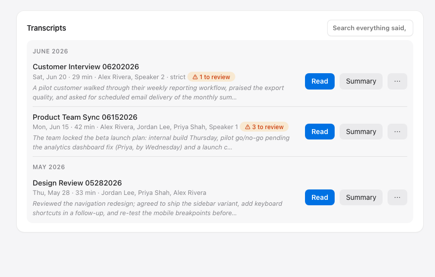
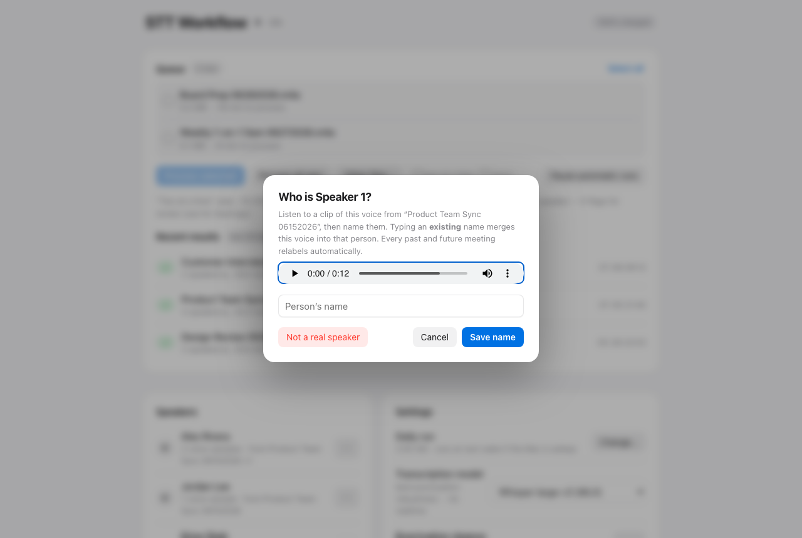
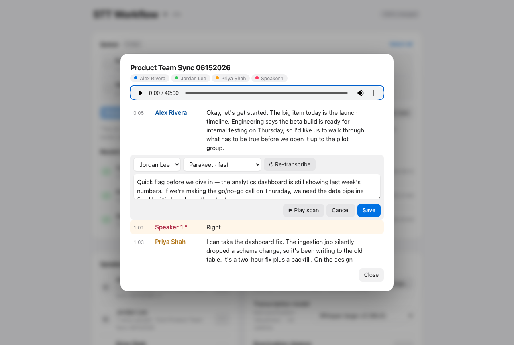

# STT Workflow — private meeting transcription for the Mac

A fully local, end-to-end pipeline that turns voice memos into named, searchable,
editable meeting transcripts. Drop a recording into a watched folder (e.g. iCloud
Drive, synced from the iPhone Voice Memos app); minutes later you have a
speaker-labeled transcript with real names attached. **No audio, text, or voice
data ever leaves your machine** — the only network use is a one-time model download.

Built for meetings you can't send to a cloud service: 1-on-1s, interviews,
personnel conversations, anything sensitive.


## Features

**Transcription**
- Two GPU-accelerated local engines, switchable per-run in the GUI:
  **NVIDIA Parakeet TDT 0.6B v2** (~30× realtime, lowest benchmark WER) and
  **Whisper large-v3 / turbo** via Apple MLX (best punctuation and robustness)
- Word-level timestamps from both engines
- **Hallucination-loop defense**: Whisper's classic "now now now…" repetition
  loops are prevented at the decoder, collapsed if they slip through, and
  flagged for human review — and existing transcripts self-heal on relabel
- **Verify mode (second opinion)**: a second, architecturally different engine
  transcribes the same audio and every disagreement is flagged for review with
  both candidates shown against the audio. Where the engines agree (~95% of
  words on our benchmark) no review is needed — agreed words matched an
  independent commercial reference ~94% of the time
- Word-preserving **punctuation/truecasing restoration** for Parakeet output
  (an ONNX post-processor that can never alter words)
- Accepts anything ffmpeg reads — including **video containers** (the audio
  track is extracted automatically)

**Speaker diarization & identity**
- **pyannote `speaker-diarization-community-1`** with overlap detection
- **Voiceprints**: name a speaker once and every past and future transcript
  updates in seconds — per-turn voice embeddings are cached, so re-naming
  never reprocesses audio, and it works even while a batch is running
- Unknown voices get **stable global numbers** across meetings ("Speaker 2"
  is the same person everywhere); freed numbers are reused after naming
- **Open-set matching** with score + margin gates: a stranger is never
  force-matched to an enrolled voice (interviews stay honest)
- Identity-first refinement corrects cross-talk misattribution using the
  enrolled voices themselves; split clusters are resolved automatically
- Per-sample voiceprint management: see which recording each sample came
  from, play it, remove a bad one; rename, merge, or un-enroll people
- **Strict mode** for sensitive recordings (hearings, HR): never guess an
  uncertain speaker — flag it for review instead; protected one-word answers
  ("yes", "no") are never smoothed away

**Review & editing**


- Uncertain segments are flagged and **triaged**: substantial items first,
  sub-second crosstalk crumbs ("like", "so") bulk-acceptable in one click
- Each review item auto-plays its exact audio span; fix the text, reassign
  the speaker, accept, or skip
- Edit **any** line in Read mode (not just flagged ones), with the option to
  **re-transcribe that span** using your choice of engine — a different model
  than the original gives an independent second opinion
- Reassign a line to **anyone** — another speaker in the meeting, any enrolled
  person, or a brand-new name the diarizer never detected (a voice buried in
  crosstalk); **add a line** the pipeline missed entirely, or **remove** a
  bogus one (echo, noise heard as speech)
- Human decisions are stored separately and **survive every relabel** —
  corrections, added and removed lines are never silently lost

**Reading, search & organization**


- Transcript viewer with color-coded speakers, tap-to-listen on any line,
  and live highlight following playback
- **Full-text search across everything ever said** — results jump straight
  to the moment in the transcript, audio cued


- Transcripts grouped by **meeting date** (parsed from filenames), filterable
  by title or attendee



**Local AI summaries (Qwen3-8B)**
- One-click **meeting summaries** and **title suggestions** generated by
  **Qwen3-8B (4-bit)** running on-device via MLX — the transcript never
  leaves the machine
- "Rename from content": the LLM reads the transcript and proposes a proper
  title; accepting renames every artifact consistently

**Export & output**
- Per meeting: readable `.txt` + structured `.json` (segment- and word-level,
  speakers, timestamps, flags, real confidence scores — never fabricated)
- **Export to Word (.docx)** or **PDF** (rendered via headless Chrome, no
  extra dependencies), **copy to clipboard**, reveal in Finder
- Atomic writes everywhere — a reader can never see a half-written transcript

**Speakers at a glance**






**Automation & operations**
- **Menu-bar app** (queue badge, live stage + ETA, stop/pause, recent results)
  plus a local-only web **control panel** at `http://127.0.0.1:8737`
- Layered triggers: nightly run (catches up at next wake if asleep) + folder
  watch (new recordings process within ~a minute) + login catch-up —
  all made safe by a single-instance lock; recordings that arrive mid-run
  are swept before the run ends
- `caffeinate` keeps the Mac awake through long runs; a **battery guard**
  skips runs below 20% on battery
- **Verified stop**: stopping kills the whole process group (including
  parallel workers), confirms nothing is left, and reports memory released
- Optional **two-at-a-time** parallel processing (~1.7× throughput)
- iCloud "dataless" placeholder files are detected and fully materialized
  before processing — no silent truncated transcripts
- Time estimates **auto-calibrate** per engine from your machine's measured
  throughput (sleep-proof monotonic timing)
- Idempotent by manifest: originals are removed from the watched folder only
  after outputs are verified; deleting a transcript makes its recording
  process fresh again
- Built-in model-update checker (Hugging Face)
- Accuracy tuning harness: score WER / DER / cpWER against reference
  transcripts (`tuning/`)
- 95+ tests: `./run.sh test`

## Requirements

- **Apple Silicon Mac (M-series) — required.** The ASR engines and the
  summarizer run on Apple's MLX framework, which only exists for Apple
  Silicon. **This will not run on Windows, Linux, or Intel Macs** without
  replacing those backends (the diarization, review, search, and export
  layers are portable Python). 16 GB RAM works; 32 GB+ recommended for
  parallel mode and the local LLM.
- macOS 14+ (developed on macOS 26)
- [Homebrew](https://brew.sh), `ffmpeg`, [`uv`](https://docs.astral.sh/uv/)
- A free [Hugging Face](https://huggingface.co) account (the diarization
  model is license-gated; inference is local, no payment)

## Setup

```bash
git clone https://github.com/<you>/stt-workflow && cd stt-workflow
brew install ffmpeg uv

# Python 3.12 environment (3.13+/3.14 lack wheels for some ML deps)
uv venv --python 3.12 .venv
uv pip install --python .venv/bin/python -r requirements.txt
```

**Hugging Face token (one-time, required for diarization):**
1. Logged in on huggingface.co, open
   [pyannote/speaker-diarization-community-1](https://huggingface.co/pyannote/speaker-diarization-community-1)
   and click *"Agree and access repository"* (accept any dependency repos it
   lists too).
2. Create a **read** token at [hf.co/settings/tokens](https://hf.co/settings/tokens).
3. `cp stt.env.example stt.env` and set `HF_TOKEN=hf_…` — `stt.env` is
   git-ignored and never leaves your machine.

**Optional — local LLM for summaries & smart renames** (Qwen3-8B-4bit, ~4.5 GB;
lives in its own environment because its `transformers` pin conflicts with the
audio stack):

```bash
uv venv --python 3.12 .venv-llm
uv pip install --python .venv-llm/bin/python mlx-lm 'transformers<5'
```

The Summary and "Suggest from content" buttons light up automatically once
`.venv-llm` exists; without it, everything else works normally.

**First run** (ASR + diarization models download automatically, ~3–5 GB):

```bash
./run.sh batch --dry-run     # shows what would be processed
./run.sh batch               # process everything new in the watched folder
```

Default watched folder is iCloud Drive's `Voice Recordings`
(`~/Library/Mobile Documents/com~apple~CloudDocs/Voice Recordings`);
transcripts land in `~/Projects/brain/meetings`. Change both in the control
panel (Settings) or via `STT_ICLOUD_DIR` / `STT_MEETINGS_DIR` in `stt.env`.

**Menu bar + control panel + automation:**

```bash
./setup.sh gui-install       # menu-bar app + control panel (http://127.0.0.1:8737)
./setup.sh install-agent     # nightly run + folder watch + login catch-up
```

launchd plists are *generated* with your paths — nothing machine-specific is
stored in the repo. The installer prints the Python binary that needs
**Full Disk Access** (System Settings → Privacy & Security) so the background
job can read iCloud Drive. Overnight runs need AC power; optional true night
wake: `sudo pmset repeat wakeorpoweron MTWRFSU 01:57:00`.

## Everyday use

Everything routes through the control panel: process recordings, watch live
progress, name speakers (▶ to hear a voice, "Who is this?" to name it), review
flagged segments against audio, read/search/edit transcripts, summarize, export.

CLI equivalents:

```bash
./run.sh batch --strict --files "Interview.m4a"   # strict: flag, never guess
./run.sh relabel --all                            # re-apply names everywhere
./run.sh enroll --from-meeting "Team Sync 05212026"
./run.sh test
```

## How it works

```
watched folder (iCloud)                          transcripts folder
  new .m4a/.mp4 ─► materialize ─► ffmpeg ─► ASR (MLX GPU) ─► loop-collapse
                                               │
             pyannote diarization (CPU) ───────┤
             voiceprint matching               ▼
             identity refinement ─► word↔speaker merge ─► punctuate
                                               │
              .txt + .json + cached embeddings (instant re-labeling)
                                               │
        review/edit decisions (sidecar, survive relabels) ─► search / export / summaries
```

Model attribution (CC-BY-4.0 weights): see [NOTICE.md](NOTICE.md).

## If you record other people

This tool stores voiceprints — **biometric data** — and verbatim records of
what people said. Treat both with care:

- The `.gitignore` keeps voiceprints, transcripts, audio, tokens, and all
  runtime state out of git. Review it before changing output paths.
- Know your local laws on recording consent (one-party vs all-party) and any
  workplace policies before making recording a routine practice.
- Set `HF_HUB_OFFLINE=1` in `stt.env` after models are cached to enforce
  fully-offline operation. The control panel binds to `127.0.0.1` only.

## License

[MIT](LICENSE)
