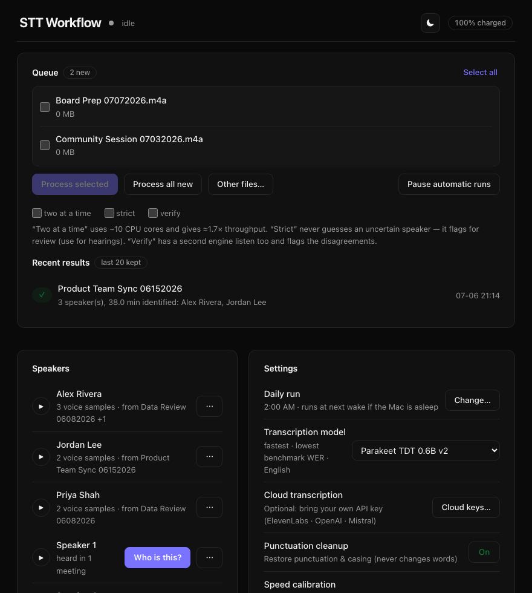

# STT Workflow: private meeting transcription for the Mac

A fully local pipeline that turns voice memos into named, searchable, editable
meeting transcripts. Drop a recording into a watched folder (iCloud Drive,
synced from the iPhone Voice Memos app); minutes later you have a
speaker-labeled transcript with real names attached and a draft summary.
**No audio, text, or voice data leaves your machine** unless you explicitly
add a cloud transcription key; the only other network use is a one-time
model download.

Built for meetings you can't send to a cloud service: 1-on-1s, interviews,
personnel conversations, anything sensitive.


## Getting started

```bash
git clone https://github.com/<you>/stt-workflow && cd stt-workflow
./init.sh
```

`init.sh` walks the whole first run interactively: it checks the machine
(Apple Silicon required, memory, free disk), installs `ffmpeg` and `uv` if
missing, builds the Python environment, asks where recordings arrive and
where transcripts should land, takes your Hugging Face token, optionally
pre-downloads the models (~3 GB) and the local summarizer LLM (~4.5 GB), and
offers to install the automation (nightly run + menu-bar app). Every step
detects what is already done, so re-running it is always safe.

Manual setup, and what each step does, is in [Setup details](#setup-details)
below.

## What it does

**Transcribe locally, at speed.** Two GPU-accelerated engines run on Apple's
MLX framework, switchable in Settings: NVIDIA Parakeet TDT 0.6B v2 (~30×
realtime, the English word-error-rate leader among local models) and Whisper
large-v3 / turbo (strongest punctuation and noise robustness). Both produce
word-level timestamps. Whisper's classic repetition loops ("now now now…")
are blocked at the decoder, collapsed if they slip through, and flagged for
review. A word-preserving punctuation restorer fixes Parakeet's lowercase
run-ons without ever changing a word. Anything ffmpeg reads is accepted,
video files included (the audio track is extracted).

**Name the speakers, once.** pyannote diarization separates the voices;
voiceprints attach names. Name a speaker one time and every past and future
transcript updates in seconds, because per-turn voice embeddings are cached
and re-naming never reprocesses audio. Unknown voices keep stable numbers
across meetings ("Speaker 2" is the same person everywhere). Matching is
open-set with a score-plus-margin gate: a stranger near an enrolled voice
never inherits that person's name, and interviews stay honest.


**Read, edit, repair.** The viewer color-codes speakers, plays audio from any
line, and follows playback with a live highlight. Every line is editable:
fix text, reassign the speaker (to anyone, including a person the diarizer
never detected), add a line the pipeline missed, remove a bogus one, or
**split** a line where two people got glued together. Reassigning a
misattributed line auto-merges it with its now-matching neighbors, so one
edit heals the whole turn. A "re-transcribe this span" button gets a second
opinion from a different engine on any single line. Human edits live in a
sidecar file and survive every relabel.


**Review what the pipeline wasn't sure about.** Uncertain segments are
flagged and triaged: substantial items first, sub-second crosstalk crumbs
bulk-acceptable in one click. Each review item cues its exact audio span.
**Verify mode** runs a second, architecturally different engine over the
same audio and flags every disagreement with both candidates shown. Where
the engines agree (~95% of words on our benchmark), the words matched an
independent commercial reference ~94% of the time, so only the disagreements
need human ears. **Strict mode** (for hearings and HR conversations) never
guesses an uncertain speaker and never sends audio to any cloud engine,
whatever the global settings say.

**Summarize automatically, on-device.** At the end of every run, Qwen3-8B
(4-bit, via MLX) drafts each new meeting's summary; it appears as the
description line in the library, no clicks needed. The same model suggests
proper titles ("Rename from content"), and renaming updates the meeting's
folder and every file in it. Each meeting stores a date (parsed from the
filename at process time, correctable in the Rename dialog) that drives the
month grouping. File timestamps are not trusted, because they reflect when
Voice Memos exported the file, often weeks after the meeting.


**Search everything ever said.** Full-text search across all transcripts
jumps straight to the moment, audio cued. The library filters by title or
attendee.

**Bring your own cloud key, if you want.** Optional adapters for ElevenLabs
Scribe, OpenAI, and Mistral Voxtral appear in the engine picker once you add
a key (Settings → Cloud keys). Only the audio uploads, recompressed small;
diarization, speaker naming, and voiceprints stay on-device, so cloud words
still get local names. A cloud failure falls back to the local engine
mid-run, and strict-mode recordings never upload. Keys are stored in
`stt.env` (git-ignored, `chmod 600`) and never shown again.

**Export.** Word (.docx), PDF, clipboard, or the underlying `.txt` and
structured `.json` (segment- and word-level timestamps, speakers, flags,
real confidence scores). Writes are atomic everywhere; a reader can never
see a half-written transcript.

**Run itself.** A menu-bar app shows queue, live stage, and ETA; the control
panel lives at `http://127.0.0.1:8737` (local-only). Recordings process
nightly, within a minute of landing in the watched folder while the Mac is
awake, and at login catch-up, all under a single-instance lock, with a
battery guard and `caffeinate` keeping long runs alive. Stopping a run kills
the whole process group and verifies nothing is left. Time estimates
calibrate themselves from your machine's measured throughput. Everything is
idempotent by manifest: the iCloud original is deleted only after outputs
are verified.

**Light and dark.** The panel follows macOS by default; the toggle in the
top bar pins light or dark, and the choice persists.



## Requirements

- **Apple Silicon Mac (M-series), required.** The transcription engines and
  the summarizer run on MLX, which only exists for Apple Silicon. This will
  not run on Windows, Linux, or Intel Macs. 16 GB RAM works; 24 GB+ is
  recommended for two-at-a-time processing and the local LLM.
- macOS 14+ (developed on macOS 26)
- [Homebrew](https://brew.sh) (`init.sh` installs `ffmpeg` and
  [`uv`](https://docs.astral.sh/uv/) through it)
- A free [Hugging Face](https://huggingface.co) account (the diarization
  model is license-gated; inference is local, no payment)

## Setup details

`./init.sh` does all of this for you; the pieces, for reference:

```bash
brew install ffmpeg uv
uv venv --python 3.12 .venv          # 3.13+/3.14 lack wheels for some ML deps
uv pip install --python .venv/bin/python -r requirements.txt
```

**Hugging Face token (one-time, required for speaker identification):**
1. Signed in on huggingface.co, open
   [pyannote/speaker-diarization-community-1](https://huggingface.co/pyannote/speaker-diarization-community-1)
   and click *"Agree and access repository"* (accept any dependency repos it
   lists too).
2. Create a **read** token at [hf.co/settings/tokens](https://hf.co/settings/tokens).
3. Put `HF_TOKEN=hf_…` in `stt.env`; the file is git-ignored and never
   leaves your machine.

**Optional local LLM** for summaries and smart renames (Qwen3-8B-4bit,
~4.5 GB; its own environment because its `transformers` pin conflicts with
the audio stack):

```bash
uv venv --python 3.12 .venv-llm
uv pip install --python .venv-llm/bin/python mlx-lm 'transformers<5'
```

Summaries and "Suggest from content" light up automatically once `.venv-llm`
exists; everything else works without it.

**Folders.** The watched folder defaults to iCloud Drive's `Voice Recordings`;
transcripts land where you point them (one folder per meeting, holding the
audio, transcript, caches, and edit history together). Change either in the
control panel's Settings or via `STT_ICLOUD_DIR` / `STT_MEETINGS_DIR` in
`stt.env`.

**Automation:**

```bash
./setup.sh gui-install       # menu-bar app + control panel
./setup.sh install-agent     # nightly run + folder watch + login catch-up
```

launchd plists are generated with your paths; nothing machine-specific is
stored in the repo. The installer prints the Python binary that needs
**Full Disk Access** (System Settings → Privacy & Security) so the
background job can read iCloud Drive. Overnight runs need AC power; for a
true night wake: `sudo pmset repeat wakeorpoweron MTWRFSU 01:57:00`.

## Everyday use

Everything routes through the control panel: process recordings, watch live
progress, name speakers (▶ plays a voice sample, "Who is this?" names it),
review flagged segments against audio, read/search/edit transcripts, export.

CLI equivalents:

```bash
./run.sh batch --dry-run                          # show what would process
./run.sh batch --strict --files "Interview.m4a"   # strict: flag, never guess
./run.sh relabel --all                            # re-apply names everywhere
./run.sh enroll --from-meeting "Team Sync 05212026"
./run.sh test                                     # 200+ tests
```

## How it works

```
watched folder (iCloud)                          transcripts folder
  new .m4a/.mp4 ─► materialize ─► ffmpeg ─► ASR (MLX GPU or cloud) ─► loop-collapse
                                               │
             pyannote diarization (CPU) ───────┤
             voiceprint matching               ▼
             identity refinement ─► word↔speaker merge ─► punctuate
                                               │
              .txt + .json + cached embeddings (instant re-labeling)
                                               │
        review/edit decisions (sidecar, survive relabels) ─► search / export / summaries
```

Model attribution (CC-BY-4.0 weights): see [NOTICE.md](NOTICE.md).

## If you record other people

This tool stores voiceprints (**biometric data**) and verbatim records of
what people said. Treat both with care:

- The `.gitignore` keeps voiceprints, transcripts, audio, tokens, and all
  runtime state out of git. Review it before changing output paths.
- Know your local laws on recording consent (one-party vs all-party) and any
  workplace policies before making recording a routine practice.
- Set `HF_HUB_OFFLINE=1` in `stt.env` after models are cached to enforce
  fully-offline operation. The control panel binds to `127.0.0.1` only.
- Cloud transcription is off unless you add a key, and strict-mode
  recordings never upload even then.

## License

[MIT](LICENSE)
